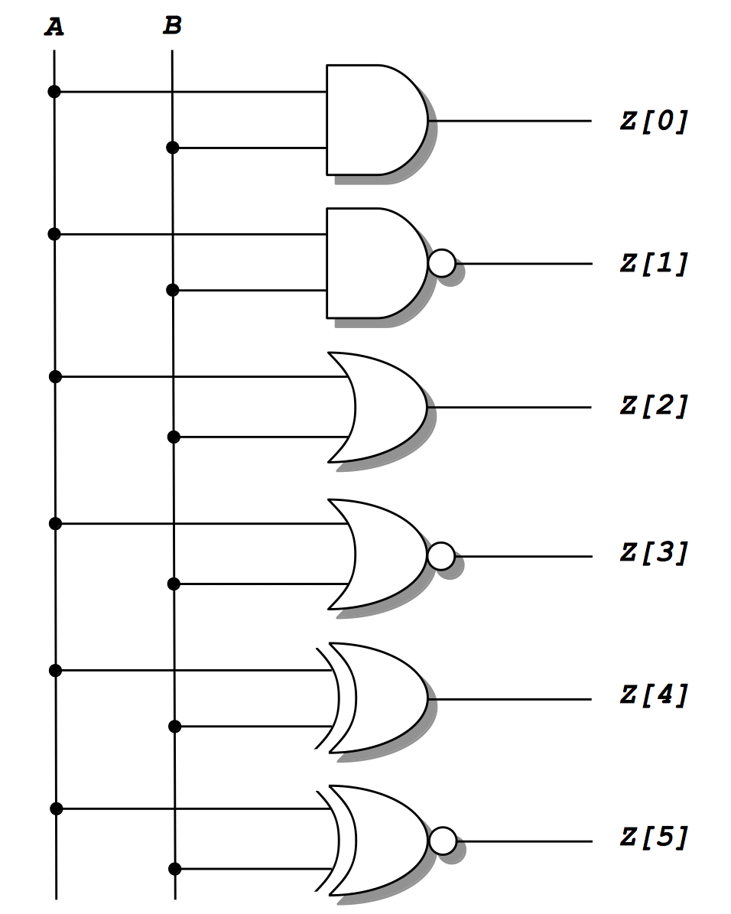
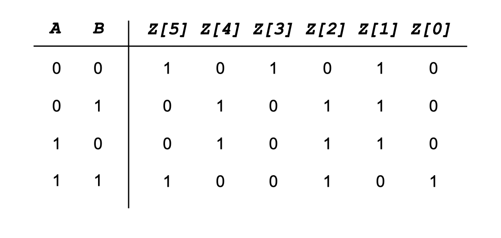

# Lab 2 Instructions
[[**Home**](https://github.com/lpacher/fphd)] [[**Back**](https://github.com/lpacher/fphd/tree/master/fpga/labs)]

## Contents

* [**Introduction**](#introduction)
* [**Lab aims**](#lab-aims)
* [**Navigate to the lab directory**](#navigate-to-the-lab-directory)
* [**Copy sources already prepared for you**](#copy-sources-already-prepared-for-you)
* [**Write and compile the DUT code**](#write-and-compile-the-dut-code)
* [**Simulate the design**](#simulate-the-design)
* [**Save and restore waveforms customizations**](#save-and-restore-waveforms-customizations)
* [**Restore a waveform database**](#restore-a-waveform-database)
* [**Exercises**](#exercises)

<br />
<!--------------------------------------------------------------------->


## Introduction
[**[Contents]**](#contents)

In this second lab we introduce basic **VHDL logical operators** to implement fundamental **logic gates**
such as AND, NAND, OR, NOR, XOR and XNOR. 

The digital circuit that we are going to describe and simulate in VHDL is the following:

<br />



<br />

Later in the course we will also **implement and debug** the above circuit on **real FPGA hardware** mapping gates outputs to some
general-purpose LEDs available
on the [**Digilent Arty A7 development board**](https://store.digilentinc.com/arty-a7-artix-7-fpga-development-board-for-makers-and-hobbyists)
to verify the expected functionality of boolean operators.

<br />
<!--------------------------------------------------------------------->


## Lab aims
[**[Contents]**](#contents)

This lab should exercise the following concepts:

* introduce VHDL logical operators
* generate a clock waveform and a synchronous counter in VHDL
* customize the waveforms appearance in the Xilinx XSim simulator graphical user interface 
* save and restore simulation results and waveforms customizations
* force/release logic values on signals for debug purposes

<br />
<!--------------------------------------------------------------------->


## Navigate to the lab directory
[**[Contents]**](#contents) 

Open a **terminal** window and change to the `lab2/` directory:

```
% cd Desktop/fphd/fpga/labs/lab2
```

<br />
<!--------------------------------------------------------------------->


## Copy sources already prepared for you
[**[Contents]**](#contents) 

For this lab **simulation scripts** and the main **testbench VHDL module** have been already prepared for you and
can be copied using `cp` from the `.solutions/` directory:


```
% cp .solutions/Makefile .
% cp .solutions/run.tcl .
% cp .solutions/tb_Gates.vhd .
```

<br />

>
> **REMINDER**
>
> Do not forget the dot `.` to indicate that the **target destination directory** for the `cp` command
> is the current working directory.
>

<br />
<!--------------------------------------------------------------------->


## Write and compile the DUT code
[**[Contents]**](#contents) 

With a **text editor** application create a new file named `Gates.v`, for example:

```
% gedit Gates.vhd &   (for Linux users)

% n++ Gates.vhd       (for Windows users)
```

<br />

Try to **complete** the following **code-skeleton** and implement all 
basic logic operations using VHDL **continuous assignments**:


```vhdl
--
-- Describe basic logic gates in VHDL using signal assignments and logic operators.
-- Available VHDL basic logical operators are :
--
-- not
-- and
-- nand
-- or
-- nor
-- xor
-- xnor (introduced by VHDL93, originally not implemented in VHDL87)
--


library IEEE ;
use IEEE.std_logic_1164.all ;   -- include extended logic values (by default VHDL only provides 0/1 with the 'bit' data type)


-- entity declaration
entity Gates is

   port (
      A : in  std_logic ;
      B : in  std_logic ;
      Z : out std_logic_vector(5 downto 0)   -- note that Z is declared as a 6-bit width output BUS
   ) ;

end entity Gates ;


-- architecture implementation
architecture rtl of Gates is

begin

   -- AND
   Z(0) <= A and B ;

   -- NAND
   Z(1) ...

   -- OR
   Z(2) ...

   -- NOR
   Z(3) ...

   -- XOR
   Z(4) ...

   -- XNOR
   Z(5) ...

end architecture rtl ;
```

<br />


Once ready, try to **parse and compile** the code with the `xvhdl` VHDL compiler:

```
% xvhdl Gates.vhd
```

<br />

In case of **syntax errors**, fix the errors issued in the terminal and re-compile the source file
after saving your changes.

<br />
<!--------------------------------------------------------------------->


## Simulate the design
[**[Contents]**](#contents) 

In order to **simulate** the block we also need a **testbench entity** to create a suitable **test pattern** for all gates.

In this case a simple **2-bits synchronous counter** can be used to easily generate **all possible input combinations**
`"00"`, `"01"`, `"10"` and `"11"` for `A` and `B` input ports.
Thus we will also learn how to generate a **clock waveform** and to implement a **counter** in VHDL.

The simulation code has been already prepared for you. Open the testbench source file `tb_Gates.vhd` that you initially copied
from the `.solutions/` directory with your text editor:

```
% gedit tb_Gates.vhd &   (for Linux users)

% n++ tb_Gates.vhd       (for Windows users)
```

<br />

Inspect the provided testbench code:

```vhdl
--
-- Example VHDL testbench to simulate basic logic gates.
--
-- The code uses a 2-bit counter running at 100 MHz to generate
-- all possible input combinations to test AND, NAND, OR, NOR etc.
--


library IEEE ;
use IEEE.std_logic_1164.all ;       -- include extended logic values (by default VHDL only provides 0/1 with the 'bit' data type)
use IEEE.std_logic_unsigned.all ;   -- to use + operator between std_logic_vector data types

library STD ;
use STD.env.all ;                   -- the VHDL2008 revision provides stop/finish functions similar to Verilog to end the simulation


entity tb_Gates is   -- empty entity declaration for a testbench
end entity tb_Gates ;


architecture testbench of tb_Gates is

   --------------------------------
   --   components declaration   --
   --------------------------------

   component Gates
      port (
         A : in  std_logic ;
         B : in  std_logic ;
         Z : out std_logic_vector(5 downto 0)
      ) ;
   end component ;


   ---------------------------------------------------
   --   testbench parameters and internal signals   --
   ---------------------------------------------------

   -- clock and clock period
   constant PERIOD : time := 10 ns ;
   signal clk : std_logic ;

   -- 2-bit counter initialized to zero
   signal count : std_logic_vector(1 downto 0) := "00" ;

   -- 6-bit bus to probe outputs
   signal Z : std_logic_vector(5 downto 0) ;


begin

   ---------------------------------
   --   100 MHz clock generator   --
   ---------------------------------

   clockGen : process   -- process without sensitivity list
   begin

      clk <= '0' ;
      wait for PERIOD/2 ;   -- simply toggle clk signal every half-period
      clk <= '1' ;
      wait for PERIOD/2 ;

   end process ;


   ----------------------
   --  2-bit counter   -- 
   ----------------------

   counter : process(clk)
   begin

      if( rising_edge(clk) ) then   -- use the rising_edge(clk) function in place of the verbose clk'event and clk = '1' syntax

         count <= count + '1' ;

      end if ;
   end process ;


   ---------------------------------
   --   device under test (DUT)   --
   ---------------------------------

   DUT : Gates port map (A => count(0), B => count(1), Z => Z) ;


   -----------------------
   --   main stimulus   --
   -----------------------

   stimulus : process
   begin

      wait for 4*PERIOD ;   -- simply run the simulation for 4x clock cycles to explore all possible input combinations

      finish ;   -- stop the simulation (this is a VHDL2008-only feature)

      -- **IMPORTANT: the original VHDL93 standard does not provide a routine to easily stop the simulation ! You must use a failing "assertion" for this purpose
      --assert FALSE report "Simulation Finished" severity FAILURE ;

   end process ;

end architecture testbench ;
```

<br />

Parse and compile also the testbench code:

```
% xvhdl tb_Gates.vhd
```

<br />

Finally, **elaborate** the top-level module and **launch the simulation** with:

```
% xelab -debug all tb_Gates
% xsim -gui tb_Gates
```

<br />

>
> **REMINDER**
>
> The value to be passed as main argument to `xelab` and `xsim` executables is the **NAME** of the top-level module,
> **NOT the corresponding VHDL source file** ! The following command-line syntax is therefore **WRONG** and generates errors:
>
> ```
> % xelab -debug all tb_Gates.vhd
> % xsim -gui tb_Gates.vhd
> ```
> Do not call `xelab` or `xsim` targeting a `.vhd` file and **always pay attention to TAB completion on files !**
>

<br />

Alternatively you can also use the `Makefile` already prepared for you:

```
% make clean
% make compile elaborate simulate
```

<br />

Add all testbench waveforms in the XSim **Wave Window** by executing the following command in the **Tcl console** :

```
add_wave /*
```

Finally, run the simulation with :

```
run all
```

Debug your simulation results.


<br />

## Save and restore waveforms customizations
[**[Contents]**](#contents) 

You can **customize waveform names**, **colors**, the **radix of buses** etc. in the Wave window at any time.
As an example, **rename top-level signals** `count(0)`, `count(1)`, `Z(0)`, `Z(1)` etc. with more meaningful
names such as `A`, `B`, `AND`, `OR` etc. and **change the default radix** for the `count(1 downto 0)` bus to **binary**.

After signals renaming you can **save your display customizations** into a **Waveform Configuration (WCFG)** XML file (`.wcfg`).
To save your customization either use the `save_wave_config` Tcl command:

```
save_wave_config ./tb_Gates.wcfg
```

or navigate through **File > Simulation Waveform > Save Configuration As**.

<br />

You can later **restore your custom display** settings with the Tcl command:

```
open_wave_config ./tb_Gates.wcfg
```

<br />

Close the simulator graphical interface when done.

<br />

You can also restore a waveform configuration using the `-view` command line switch when invoking the `xsim` executable at the command line:

```
% xsim -gui -tclbatch run.tcl -view tb_Gates.wcfg tb_Gates
```

<br />
<!--------------------------------------------------------------------->


## Restore a waveform database
[**[Contents]**](#contents)

By default all HDL objects selected for tracing in the Wave window and then simulated are automatically
saved by XSim into a **binary database** placed in the `xsim.dir/` directory and referred to as **Waveform Database** (`.wdb`).

This binary database can be used to **restore simulation results** without the need of re-running a simulation
from scratch.

Try to restore all previous simulation results and waveforms customizations as follows:

```
xsim -gui -view tb_Gates.wcfg xsim.dir/tb_Gates.wdb
```

<br />

>
> **NOTE**
>
> In this case the main target for the `xsim` executable is **the name of waveform database**, not the name of the simulation executable!
>

<br />
<!--------------------------------------------------------------------->


## Exercises
[**[Contents]**](#contents)

<br />

**EXERCISE 1**


Reset the simulation executable back to _t=0 ns_ and try to re-simulate the design by adding a **force/release** of an unknown logic
value `X` on the `A` input signal as follows:

```
restart
run 500 ns
add_force {/tb_Gates/A} X ;    ## this is short for add_force {/tb_Gates/A} -radix bin {1 0ns}
run 500 ns
remove_forces -all
run all
```
<br/>

Observe the output logic values generated by logic gates AND, NAND etc.

<br />

>
> **QUESTION**
>
> Is the result the expected one ? 
>
>   \____________________________________________________________________________________________________
>

<br />

The force/release of a logic constant is a useful **debug technique** for **troubleshooting waveforms** when
something is not properly working as expected in simulations. You can also write testbench stimuli
in Tcl with such a technique, but this choice is less popular than using a testbench written in Verilog or VHDL.

<br/>

Explore the command line help of the commands :

```
add_force -help
remove_force -help
```

<br />

**EXERCISE 2**

Instead of using logic operators we can also implement the functionality of each basic gate in terms of a **truth table**.<br/>
A VHDL `when/else` statement can be used for this purpose.

<br />



<br />


Create a new file e.g. `GatesTruthTable.vhd` and try to **complete** the following **code skeleton**:

```vhdl
--
-- Implement basic logic gates in terms of truth tables using 'when/else' statements
--
-- Luca Pacher - pacher@to.infn.it
-- Spring 2023
--


library IEEE ;
use IEEE.std_logic_1164.all ;   -- include extended logic values (by default VHDL only provides 0/1 with the 'bit' data type)


-- entity declaration
entity GatesTruthTable is

   port (
      A : in  std_logic ;
      B : in  std_logic ;
      Z : out std_logic_vector(5 downto 0)   -- note that Z is declared as a 6-bit width output BUS
   ) ;

end entity GatesTruthTable ;


-- architecture implementation
architecture rtl of GatesTruthTable is

begin


   Z <= "101010" when A = '0' and B = '0' else
        "010110" when A = '0' and B = '1' else
        "010110" when A = '1' and B = '0' else
        "100101" when A = '1' and B = '1' else 
        "XXXXXX" ;   -- catch-all

end architecture rtl ;
```

<br />

We can simulate this new implementation using the same previous testbench code, just **update the names of the entity that 
you want to test** in the component declaration and in the DUT instantiation in the `tb_Gates.vhd` file:

```vhdl
architecture testbench of tb_Gates is

   --------------------------------
   --   components declaration   --
   --------------------------------

   --component Gates
   component GatesTruthTable
      port (
         A : in  std_logic ;
         B : in  std_logic ;
         Z : out std_logic_vector(5 downto 0)
      ) ;
   end component ;

   ...
   ...

   ---------------------------------
   --   device under test (DUT)   --
   ---------------------------------

   --DUT : Gates port map (A => count(0), B => count(1), Z => Z) ;
   DUT : GatesTruthTable port map (A => count(0), B => count(1), Z => Z) ;

   ...
   ...

end architecture testbench ;
```

<br />

To speed up the simulation you can use the `Makefile` already prepared for you.
With a **text editor** update your `Makefile` to parse and compile `GatesTruthTable.vhd` instead of `Gates.vhd` as follows:


```make
#SOURCES := Gates.vhd tb_Gates.vhd
SOURCES := GatesTruthTable.vhd tb_Gates.vhd
```

<br />

Save your changes and re-run the simulation with:


```
% make clean
% make sim
```

