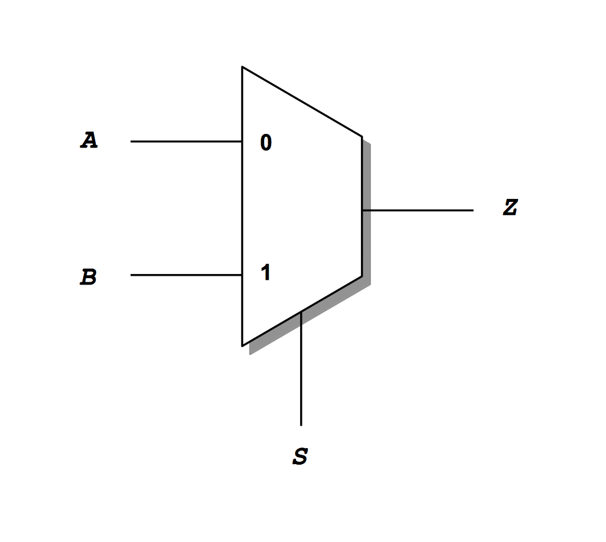
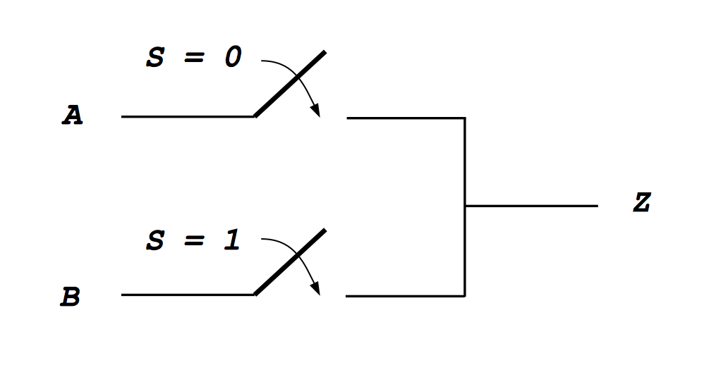
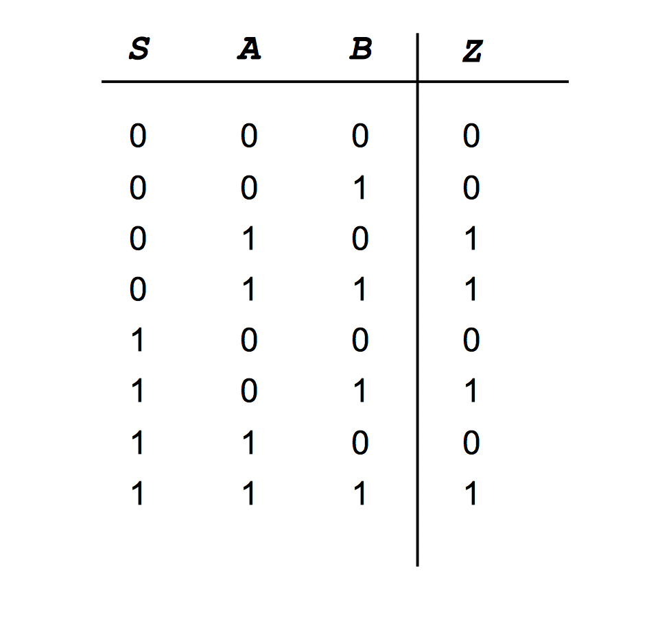
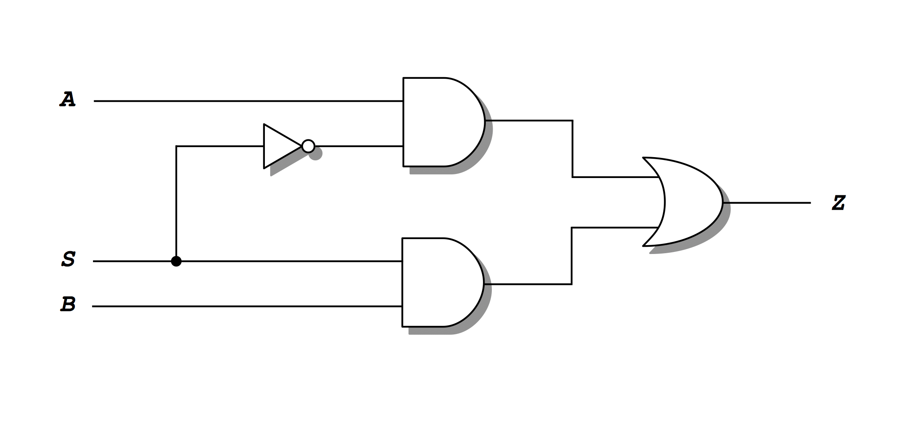
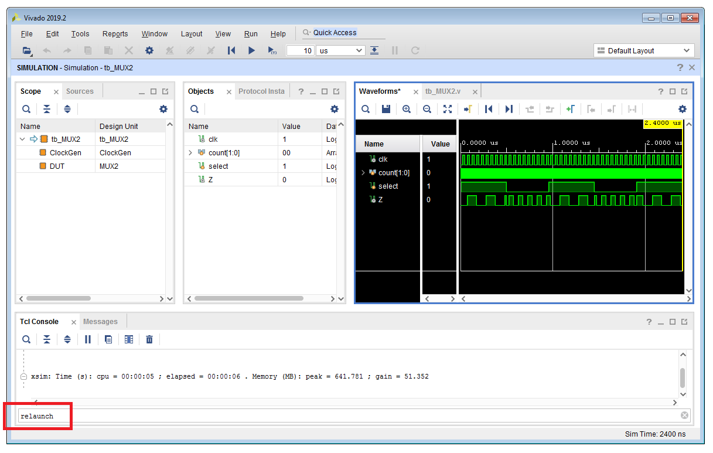
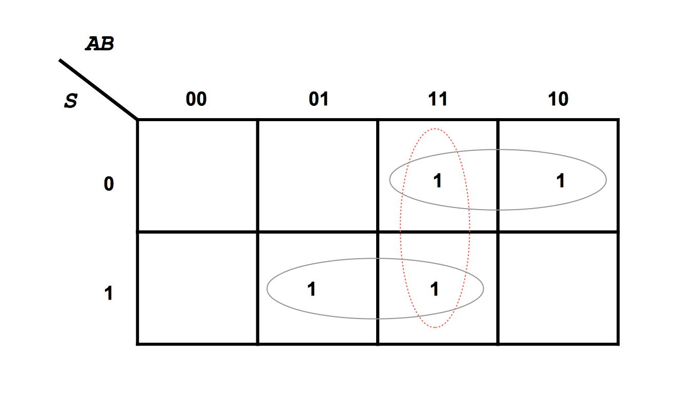
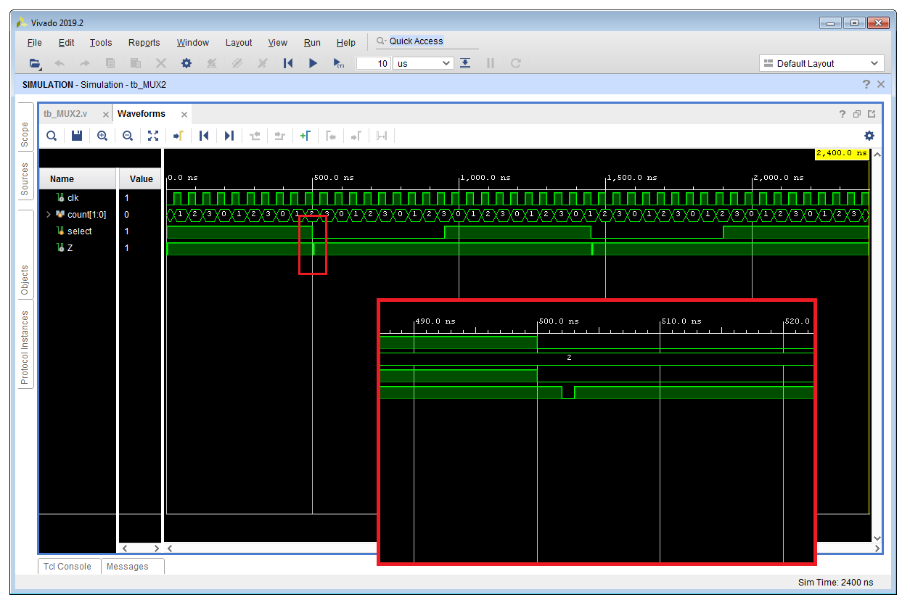
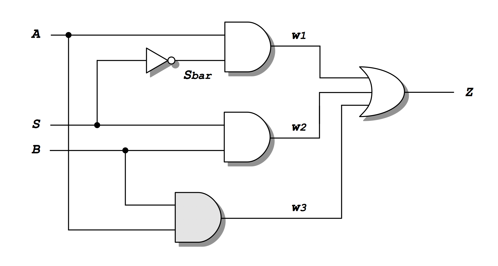
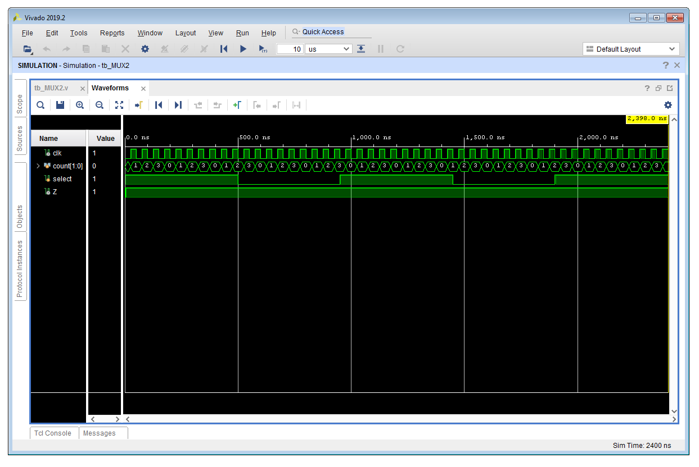
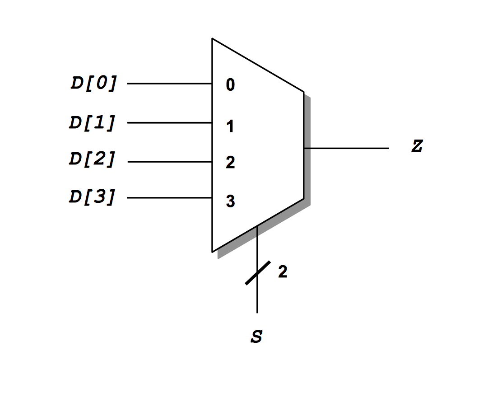

# Lab 3 Instructions
[[**Home**](https://github.com/lpacher/fphd)] [[**Back**](https://github.com/lpacher/fphd/tree/master/fpga/labs)]

## Contents

* [**Introduction**](#introduction)
* [**Lab aims**](#lab-aims)
* [**Navigate to the lab directory**](#navigate-to-the-lab-directory)
* [**Setting up the work area**](#setting-up-the-work-area)
* [**Copy simulation scripts**](#copy-simulation-scripts)
* [**RTL coding**](#rtl-coding)
* [**Simulate the design**](#simulate-the-design)
* [**Re-launch a simulation from the GUI after HDL changes**](#re-launch-a-simulation-from-the-gui-after-hdl-changes)
* [**A first look to timing issues**](#a-first-look-to-timing-issues)
* [**Exercises**](#exercises)

<br />
<!--------------------------------------------------------------------->


## Introduction
[**[Contents]**](#contents)


In this lab we introduce a certain number of **new VHDL constructs** and we discuss different **coding styles** in HDL.<br/>
The digital block used for this purpose is a simple **2-inputs multiplexer (MUX)**:





We also introduce a **better working area organization** and an **improved script-based simulation flow** that allows
to easily **re-invoke compilation/elaboration/simulation steps** from the XSim GUI in non-project mode.


<br />
<!--------------------------------------------------------------------->


## Lab aims
[**[Contents]**](#contents)

This lab should exercise the following concepts:

* introduce a better working area organization
* introduce new VHDL constructs and statements
* use an improved Makefile-based simulation flow
* re-launch a simulation from the XSim graphical interface after HDL modifications
* debug timing-hazards in combinational circuits

<br />
<!--------------------------------------------------------------------->


## Navigate to the lab directory
[**[Contents]**](#contents)

Open a **terminal** window and change to the `lab3/` directory:

```
% cd Desktop/fphd/fpga/labs/lab3
```

<br />
<!--------------------------------------------------------------------->


## Setting up the work area
[**[Contents]**](#contents)

An improved `Makefile` example has been already prepared for you, copy the script
from the `.solutions/` directory with the `cp` command:

```
% cp .solutions/Makefile .
```

<br />

>
> **REMINDER**
>
> Do not forget the final dot `.` to indicate that the **target destination directory** for the `cp` command
> is the current working directory!
>

<br />

Explore the content of the proposed `Makefile` at the command line using `cat`, `more` or `less` or with a text editor as preferred:

```
% cat Makefile
% less Makefile etc.
```

<br />

Invoke the `help` target to list all available targets:

```
% make help
```

<br />

Finally, **create a new fresh working area** with:

```
% make area
```

<br />

List the content of the directory to understand the new sources organization:

```
% ls -l
```

<br />

|       Folder       |                           Description                                |
|--------------------|----------------------------------------------------------------------|
| `rtl/`             | RTL sources (synthesizable code that can be mapped on a target FPGA) |
| `bench/`           | simulation sources (non-synthesizable code) |
| `scripts/common/`  | Tcl scripts common to all flows|
| `scripts/sim/`     | Tcl scripts for compilation/elaboration/simulation |
| `scripts/build/`   | Tcl scripts for physical implementation to target FPGA |
| `scripts/install/` | Tcl scripts for firmware installation |
| `work/sim/`        | scratch simulation working area where `xvlog/xvhdl/xelab/xsim` executables are invoked |
| `work/build/`      | scratch implementation working area where `vivado` executable is invoked |
| `bin/`             | additional directory for non-Tcl scripts and programs (e.g. Bash/Batch, Python) |
| `log/`             | all log files |
| `cores/`           | IP sources (compiled from the IP Catalog within Vivado) |
| `xdc/`             | implementation design constraints |
| `test/`            | directory for additional user tests |
| `tmp/`             | temporary directory |
| `doc/`             | specifications, design documentation, PDF etc. |

<br/>

>
> **NOTE**
>
> The proposed working area has been re-adapted from the
> [**directory structure recommended by OpenCores**](https://cdn.opencores.org/downloads/opencores_coding_guidelines.pdf).
>

<br />

From now on, **synthesizable RTL sources** will be stored inside the `rtl/` directory, while the **testbench module** along with other
**simulation sources** inside the `bench/` directory.


<br />
<!--------------------------------------------------------------------->


## Copy simulation scripts
[**[Contents]**](#contents)

Copy from the `.solutions/` directory all **Tcl simulation scripts** already prepared for you:

```
% cp .solutions/scripts/sim/compile.tcl    scripts/sim/
% cp .solutions/scripts/sim/elaborate.tcl  scripts/sim/
% cp .solutions/scripts/sim/simulate.tcl   scripts/sim/
% cp .solutions/scripts/sim/probe.tcl      scripts/sim/     
% cp .solutions/scripts/sim/run.tcl        scripts/sim/
% cp .solutions/scripts/sim/relaunch.tcl   scripts/sim/
```
<br />

For less typing, you can also use the **wildcard character** `*` as follows

```
% cp .solutions/scripts/sim/*.tcl   scripts/sim/
```
<br />

or you can perform a **recursive copy** of the entire `.solutions/sim/` directory with

```
% cp -r .solutions/scripts/sim/ scripts/
```
<br />


Verify that all required scripts are in place:

```
% ls -l scripts/sim/
```

<br/>

>
> **WARNING**
>
> If you want to use the asterisk `*` as **wildcard** for `cp` on Windows, please be aware that the `cp.exe` executable
> that comes with the _GNU Win_ package works properly **only using forward slashes** `/` **in the path!**
>
> ```
> % cp .solutions/scripts/sim/*.tcl   scripts/sim/
> ```
>
> If you use the **TAB completion** on Windows the path is completed using **back slashes** `\` but the resulting command **DOESN'T WORK and generates an error**
> because back-slashes `\` are interpreted as **escape characters** by `cp.exe`:
>
> ```
> % cp .solutions\scripts\sim\*.tcl   scripts\sim\
>
> cp: cannot stat '.solutionsscriptssim*.tcl' : No such file or directory
> ```
> 
> You can use the native `copy` **DOS command** instead:
>
> ```
> % copy .solutions\scripts\sim\*.tcl   scripts\sim\
> ```
>
> The are no issues in performing a recursive copy instead:
>
> ```
> % cp -r .solutions\scripts\sim\ scripts\
> ```
>

<br />
<!--------------------------------------------------------------------->


## RTL coding
[**[Contents]**](#contents)

In this case we are going to explore **different MUX implementations** in order to demonstrate how one can use **different coding-styles**
in HDL to achieve the same functionality for a digital block.

<br />

As a first step, create a new VHDL file `rtl/MUX2.vhd` with your **text editor** application:

```
% gedit rtl/MUX2.vhd &   (for Linux users)

% n++ rtl\MUX2.vhd       (for Windows users)
```

<br />


The main entity declaration is the following:

```vhdl
library IEEE ;
use IEEE.std_logic_1164.all ;   -- include extended logic values (by default VHDL only provides 0/1 with the 'bit' data type)


entity MUX2 is

   port (
      A : in  std_logic ;
      B : in  std_logic ;
      S : in  std_logic ;   -- select bit
      Z : out std_logic
   ) ;

end entity MUX2 ;
```
<br />

For this VHDL entity we can then write **different architectures**, one for each proposed implementation.
The actual VHDL architecture to be simulated is then selected using a **component configuration (binding)**
statement in the testbench.
<br /><br />


**IF/ELSE STATEMENT**

The **functionality** of our multiplexer is to **select** between `A` and `B` inputs and connect the selected input to the single output `Z`.<br />
It is therefore quite intuitive to think in terms of **open/closed switches** according to the value of the `S` control signal:

<br />



<br />

A first possible coding solution to implement this functionality is therefore by using a **behavioural description** with
a **software-like** `if/else` statement inside a `process` procedural block:

```vhdl
---------------------------------
--   if/else behavioral code   --
---------------------------------
architecture if_else of MUX2 is

begin

   --process(all)    -- VHDL-2008 only feature
   process(A,B,S)  -- **IMPORTANT: this is a COMBINATIONAL block, all signals contribute to the SENSITIVITY LIST
   begin
      if(S = '0') then
         Z <= A ;
      else
         Z <= B ;
      end if ;
   end process ;

end architecture if_else ;
```

<br />

Note the usage of the `process` syntax. This is a first example of how you can use software-like **procedural statements**
in your VHDL code to implement real hardware.

<br />

**CONDITIONAL ASSIGNMENT**

The `if/else` functionality can be also implemented using a more compact `when/else` **conditional assignment** already introduced
in the `lab1` to implement an inverter or a 3-state buffer:

```vhdl
------------------------------------------
--   when/else conditional assignment   --
------------------------------------------
architecture when_else of MUX2 is

begin

   Z <= A  when S = '0' else
        B  when S = '1' else
        'X' ;   -- catch-all

end architecture when_else ;
```
<br />

Beside `when/else` VHDL also provides the `with/select` conditional assignment to implement the same functionality:

```vhdl
--------------------------------------------
--   with/select conditional assignment   --
--------------------------------------------
architecture with_select of MUX2 is

begin

   with S select
   
      Z <= A when '0',
           B when '1',
           'X' when others ;   -- catch-all

end architecture with_select ;
```
<br />


**TRUTH TABLE**

A multiplexer is a **pure combinational digital circuit**. Thus its functionality is **uniquely** specified by giving
its **truth table** as follows:

<br />



<br />

We can therefore use also a **software-like** `case` statement inside another `process` procedural block
and write the truth table of the combinational circuit:


```vhdl
--------------------------------------
--   truth table (case statement)   --
--------------------------------------
architecture truth_table of MUX2 is

   signal SAB : std_logic_vector(2 downto 0) ;   -- auxiliary internal BUS to check (S,A,B) values at the same time

begin

   SAB <= S & A & B ;   -- concatenation

   process(A,B,S)
   begin

      case( SAB ) is

         when "000" => Z <= '0' ;   -- A
         when "001" => Z <= '0' ;   -- A
         when "010" => Z <= '1' ;   -- A
         when "011" => Z <= '1' ;   -- A
         when "100" => Z <= '0' ;   -- B
         when "101" => Z <= '1' ;   -- B
         when "110" => Z <= '0' ;   -- B
         when "111" => Z <= '1' ;   -- B

         -- catch-all
         when others => Z <= 'X' ;

      end case ;
   end process ;

end architecture truth_table ;
```
<br />


**LOGIC EQUATION**

Finally, we can also implement the block by writing the **logic equation**
using VHDL **logical operators** `and`, `or` and `not` as it can be derived from the **truth table**.
If a **sum-of-products (SoP)** approach is used the resulting circuit is the following:

<br />




```vhdl
------------------------
--   logic equation   --
------------------------
architecture logic_equation of MUX2 is

begin

   Z <= (A and (not S)) or (B and S) ;  
         
end architecture logic_equation ;
```
<br />

In this case the logic equation has been specified into a single line of code. Alternatively the same equation can be split
into step-by-step computations, thus requiring to declare all intermediate `signals` in VHDL:

```vhdl
architecture logic_equation of MUX2 is

   -- internal signals
   signal Sbar : std_logic ;    -- not S
   signal w1   : std_logic ;    -- A and Sbar
   signal w2   : std_logic ;    -- B and S

begin

   ------------------------
   --   logic equation   --
   ------------------------

   --Z <= (A and (not S)) or (B and S) ;

   Sbar <= not S ;

   w1 <= A and Sbar ;
   w2 <= B and S ;

   Z  <= w1 or w2 after 1ns ;

end architecture logic_equation ;
```

<br />

**COMPILE THE CODE**

Once ready try to **compile** the VHDL file with:

```
% make compile hdl=rtl/MUX2.vhd
```
<br />

Try yourself to **fix syntax errors** if present.

<br />
<!--------------------------------------------------------------------->


## Simulate the design
[**[Contents]**](#contents)

The testbench code has been already prepared four you and can be copied from the `.solutions/` directory as follows:

```
% cp .solutions/bench/tb_MUX2.vhd bench/
```

<br />

Open the file with your text editor and inspect the code:

```
% gedit bench/tb_MUX2.vhd &   (for Linux users)

% n++ bench\tb_MUX2.vhd       (for Windows users)
```

<br />

Try to **simulate** the default `if/else` implementation and **verify the expected functionality** of a 2:1 multiplexer.
Use the `Makefile` to automate the simulation flow:

```
% make clean
% make sim
```

<br />
<!--------------------------------------------------------------------->


## Re-launch a simulation from the GUI after HDL changes
[**[Contents]**](#contents)

Let suppose that we initially simulated the default `if/else` MUX implementation and that now we want to verify the functionality of
the logic equation. As a matter of fact this only requires small changes to our HDL sources, just comment-out

```
use entity work.MUX2(if_else) ;
```
<br />

and uncomment

```
use entity work.MUX2(logic_equation) ;
```
<br />

in the **component configuration** section of the testbench as follows:


```vhdl
--------------------------------------------------------
--   component configuration (architecture binding)   --
--------------------------------------------------------

-- choose here which MUX2 architecture to simulate
for DUT : MUX2
   --use entity work.MUX2(if_else) ;
   --use entity work.MUX2(when_else) ;
   --use entity work.MUX2(with_select) ;
   --use entity work.MUX2(truth_table) ;
   use entity work.MUX2(logic_equation) ;
```

<br />

Certainly given the small change made to HDL sources it would be desirable to have the possibility to simply "reinvoke"
the simulation flow from the XSim GUI without the need of exiting XSim and relaunch `make sim` from scratch.
Unfortunately this operation is supported by Xilinx **only** if you work in the so called **Project Mode**.

Vivado in fact extensively supports scripts-based flows either in so called **Project Mode** or **Non Project Mode**.
When you work in "Project Mode" you basically initially specify HDL sources and other input design data (e.g. constraints)
and then you let Vivado to manage all flows for you. In this case Vivado generates compilation/elaboration/simulation scripts for you
and automatically re-creates these scripts in case of HDL changes and the simulation can be easily **relaunched** from the XSim graphical
interface using **Run > Relaunch Simulation** or typing `relaunch_sim` in the Tcl console. This is nice, but all flows details remain "hidden"
to the user.

In "Non Project Mode" instead it's up to the user to manage design sources and to run all required Tcl commands,
but this solution is only supported for FPGA physical implementation. Indeed, there is no "Non Project Mode" Tcl simulation
flow in Vivado, in this case "Non Project Mode" flow means to call standalone `xvlog/xvhdl`, `xelab` and `xsim` executables
from the command-line, from a shell script or inside a GNU Makefile as proposed for this course.
As a result in "Non Project Mode" the simulation **cannot be re-invoked** from the XSim GUI through **Run > Relaunch Simulation**
after RTL or testbench changes, thus requiring to exit from XSim and re-build the simulation
from scratch. This happens because the XSim standalone flow doesn't **keep track** of `xvlog/xvhdl`
and `xelab` flows.


In order to be able to **"relaunch" a simulation from the GUI** you necessarily have to
**create a project in Vivado**, either in GUI mode or using a "Project Mode" Tcl script
to automate the simulation.

As an example:

```
## create Vivado project attached to Arty-A7 device
create_project project_1 project_1 -part xc7a35ticsg324-1L

## target HDL
set_property simulator_language VHDL [current_project]

## add RTL sources to the propject
add_files -norecurse -fileset sources_1 [glob [pwd]/rtl/*.vhd]

## add simulation sources to the project
add_files -fileset sim_1 -norecurse [glob [pwd]/bench/*.vhd]

## import all files
import_files -force -norecurse
update_compile_order -fileset sources_1
update_compile_order -fileset sim_1

## one-step compilation/elaboration/simulation
launch_simulation
```

The overhead of creating a Vivado project is low compared to the benefits of fully automated
one-step compilation/elaboration/simulation and re-launch features.

In order to keep working with simulations using a command-line approach the proposed solution is to use the Tcl programming language
and the `tclsh` shell.
In this lab in fact we improved the overall simulation by flow moving all calls to standalone executables `xvlog/xvhdl`, `xelab` and `xsim`
into `compile.tcl`, `elaborate.tcl` and `simulate.tcl` Tcl scripts executed by `tclsh` from `Makefile`. This **custom** Tcl-based simulation
flow basically reproduces all compilation/elaboration/simulation steps that actually Vivado performs "under the hood" for you without
notice in "Project Mode".

Thanks to Tcl this custom flow is **portable across Linux/Windows systems**. Additionally we are able
to "relaunch" a simulation after RTL or testbench changes from the XSim Tcl console using the custom routine

```
relaunch
```

<br />

without the need of creating a Vivado project. You can also customize the XSim GUI and add this custom Tcl routine to
the toolbar through **Tools > Custom Commands > Customize Commands**.



<br />

Use this feature to **simulate all possible different implementations** and verify the expected functionality of a 2:1 multiplexer,
simply comment/uncomment each time VHDL `use entity` statements accordingly.

Exit from the XSim simulator once done.

<br />

Explore the content of improved simulation scripts using `cat`, `more` or `less` or with a text editor as preferred:

```
% more scripts/sim/compile.tcl
% less scripts/sim/elaborate.tcl  etc.
```

<br />

>
> **QUESTION**
>
> Where is defined the custom `relaunch` Tcl routine? Which script loads it in the XSim environment? <br /><br />
>
>   \____________________________________________________________________________________________________
>

<br />

For more details about Vivado flows please refer to Xilinx official documentation:

* [_Vivado Design Suite User Guide: Design Flows Overview (UG892)_](
https://www.xilinx.com/support/documentation/sw_manuals/xilinx2019_2/ug892-vivado-design-flows-overview.pdf)

<br />
<!--------------------------------------------------------------------->


## A first look to timing issues
[**[Contents]**](#contents)

Le last MUX implementations using logic operators provides a first test case to introduce **timing issues in digital circuits**.
It is well known in fact that the logic equation of a 2:1 multiplexer is **intrinsically** affected by a timing issue
in form of a **static-one hazard**.

The problem can be immediately recognized by looking at the **Karnaugh map** associated to the truth table of the combinational block,
in which we can see that there are two vertical adjacent 1s (when `A = B = 1`) which in principle are redundant in terms
of minimum logic equation and can be therefore left ungrouped. Indeed, whenever there are adjacent 1s in the map left ungrouped
this is a symptom of a timing issue. 

<br />



<br />

We can therefore expect that by including **propagation delays** in our **logic-equation simulation** some sort of
**timing _"glitch"_** should appear when the select signal `S` changes while keeping both MUX inputs `A` and `B` high.

In order to verify this we can modify the logic-equation architecture of the MUX implementation
by **adding 1 ns propagation delay to all logical operators** as follows:

```vhdl
architecture logic_equation of MUX2 is

   -- internal signals
   signal Sbar : std_logic ;
   signal w1   : std_logic ;
   signal w2   : std_logic ;

begin

   ------------------------
   --   logic equation   --
   ------------------------

   --Z <= (A and (not S)) or (B and S) ;

   Sbar <= not S after 1ns ;

   w1 <= A and Sbar after 1ns ;
   w2 <= B and S after 1ns ;

   Z  <= w1 or w2 or w3 after 1ns ;

end architecture logic_equation ;
```


<br />

Beside RTL changes, **update also the testbench** in order to keep `A` and `B` MUX inputs always connected to logic `1`:

```vhdl
--DUT : MUX2 port map ( A => count(0), B => count(1), S => select, Z => Z) ;
DUT : MUX2 port map ( A => '1', B => '1', S => select, Z => Z) ;
```

<br />

Save all modifications and re-simulate the design from scratch:

```
% make clean sim
```

<br />

Debug simulation results by looking at waveforms. You should be able to confirm that **glitches** in form of **static-one timing hazards**
appear on the MUX output whenever the selection control changes from high to low, while the timing hazard is not present for the low-to-high
transition.




<br />

You can also play with delay values, but the timing issue is **intrinsic** to the circuit, thus **delay-independent**.
In order to fix the glitch we have to **include all possible adjacent 1s in the Karnaugh map**, thus resulting into a **redundant logic**
equation but a **timing-clean digital circuit**.

This can be achieved by adding one more AND-gate between `A` and `B` inputs as follows:

<br />




Update the logic description in the MUX code to implement this fix:


```vhdl
architecture logic_equation of MUX2 is

   -- internal signals
   signal Sbar : std_logic ;
   signal w1   : std_logic ;
   signal w2   : std_logic ;
   signal w3   : std_logic ;

begin

   ------------------------
   --   logic equation   --
   ------------------------

   --Z <= (A and (not S)) or (B and S) ;

   Sbar <= not S after 1ns ;

   w1 <= A and Sbar after 1ns ;
   w2 <= B and S after 1ns ;
   w3 <= A and B after 1ns ;

   Z  <= w1 or w2 after 1ns ;

end architecture logic_equation ;

```

<br />

Save the file after modifications and try to **relaunch the simulation** from the XSim Tcl console:

```
relaunch
```

<br />

Verify that after the fix all glitches disappear from the simulation.

<br />




<br />
<!--------------------------------------------------------------------->


## Exercises
[**[Contents]**](#contents)

<br />

**EXERCISE 1**

Generating a clock signal for simulation purposes is a very common testbench feature, thus it is a good practice
to create some dedicated **reusable and parameterizable clock-generator module** for this purpose. This can be done
using VHDL `generic` in the entity declaration.

Create a new VHDL source file `bench/ClockGen.vhd` with your text-editor

```
% gedit bench/ClockGen.vhd &   (for Linux users)

% n++ bench\ClockGen.vhd       (for Windows users)
```

<br />

and implement a clock generator with parameterized clock-period using `generic` as follows:


```vhdl
library IEEE ;
use IEEE.std_logic_1164.all ;


entity ClockGen is

   generic (
      PERIOD : time := 10 ns   -- default clock frequency will be 100 MHz
   ) ;

   port (
      clk : out std_logic
   ) ;

end entity ClockGen ;


architecture stimulus of ClockGen is

begin

   process   -- process without sensitivity list
   begin

      clk <= '0' ;
      wait for PERIOD/2 ;   -- simply toggle clk signal every half-period
      clk <= '1' ;
      wait for PERIOD/2 ;

   end process ;

end architecture stimulus ;
```

<br />

Once done, modify also the testbench in order to **instantiate** the new module in place of the previous behavioral code:

```vhdl
architecture testbench of tb_MUX2 is

   ...
   ...

   component ClockGen is
      generic (
         PERIOD : time := 10ns
      ) ;
      port (
         clk : out std_logic
      ) ;
   end component ;

   ...
   ...

begin

   ---------------------------------
   --   100 MHz clock generator   --
   ---------------------------------

   ClockGen_inst : ClockGen port map (clk => clk) ; 

   ...
   ...

end architecture testbench ;
```

<br />

In order to simulate the design, extend the `SIM_VHDL_SOURCES` variable in the `Makefile` in order to parse and compile also
the new `bench/ClockGen.vhd` file:

```
SIM_VHDL_SOURCES := $(SIM_DIR)/tb_MUX2.vhd $(SIM_DIR)/ClockGen.vhd
```

<br />

Re-compile and re-simulate the design from scratch:

```
% make clean sim
```

<br />


**EXERCISE 2**

Modify the testbench code in order to generate all MUX inputs using a **3-bit synchronous counter**:

```vhdl
DUT : MUX2 port map (A => count(0), B => count(1), S => count(2), Z => Z) ;
```

<br />

Re-compile and re-simulate the design from scratch:

```
% make clean sim
```

<br />


**EXERCISE 3**

Change back to the `lab1` directory. Try to re-implement the code of a simple **inverter** using an `if/else` statement
within a `process` **procedural block**:

```vhdl
process(X)
begin
   if (X = '1') then
      Z <= '0' ;
   else
      Z <= '1' ;
   end if ;
end process ;
```

Simulate the code to check the expected functionality of an inverter.

<br />


**EXERCISE 4**

Create a new source file `rtl/MUX4.vhd`. Start from the code
of a **2-inputs multiplexer** and try to implement a **4-inputs multiplexer** instead:

<br />



<br />

```vhdl
library IEEE ;
use IEEE.std_logic_1164.all ;

entity MUX4 is

   port (

      D : in  std_logic_vector(3 downto 0) ;   -- 4 inputs
      S : in  std_logic_vector(1 downto 0) ;   -- select BUS
      Z : out std_logic
   ) ;

end entity MUX4 ;

architecture rtl of MUX4 is

begin

   process(...)
   begin
      ...
      ...
   end process

end architecture rtl ;
```

<br />

Write a suitable VHDL testbench `bench/tb_MUX4.vhd` in order to verify the proper functionality of the new block.

Once done, update the `Makefile` in order to parse new sources in place of the old ones:

```
#
#RTL_TOP_MODULE := MUX2
#SIM_TOP_MODULE := tb_MUX2
#
RTL_TOP_MODULE := MUX4
SIM_TOP_MODULE := tb_MUX4
#
#RTL_VHDL_SOURCES := $(RTL_DIR)/MUX2.vhd
#SIM_VHDL_SOURCES := $(SIM_DIR)/tb_MUX2.vhd $(SIM_DIR)/ClockGen.vhd
#
RTL_VHDL_SOURCES := $(RTL_DIR)/MUX4.vhd
SIM_VHDL_SOURCES := $(SIM_DIR)/tb_MUX4.vhd $(SIM_DIR)/ClockGen.vhd
```

<br />


Compile and simulate the new design from scratch:

```
% make clean sim
```

Verify the proper functionality of the new digital block.

